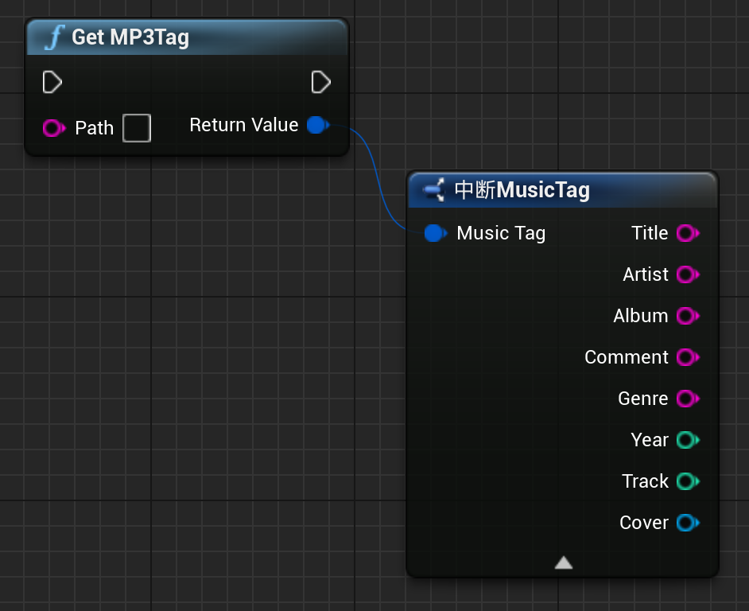

# TagLib4UE
[TagLib](https://taglib.org/) 的虚幻引擎插件。仅支持获取tag信息。

[TagLib](https://taglib.org/) plugin for Unreal Engine. Only support getting tag info.

TagLib 版本(Version): v2.0.2 

## 安装 Install

下载本项目，把`TagLib2`文件夹放到你的项目的`Plugins`文件夹下。打开你的项目，在插件里搜索并启用TagLib即可。

Download this project and copy the `TagLib2` folder to your project's `Plugins` folder. Open your project, search for TagLib and enable it in the plugins page.

## 使用 Usage

蓝图中使用，Path输入要读取的mp3或其他音频格式文件的地址即可。返回的信息中，`Cover`为tag的第一张图，格式为Texture2D. `Cover`需要自行判断是否有效。其他字符串默认值为空，int默认值为0.
Used in the blueprint, the Path input is the address of the mp3 or other audio format file to be read. In the returned information, `Cover` is the first image of the tag, in the format of Texture2D. `Cover` needs to be determined by yourself whether it is valid. Other strings have default values of empty, and int has a default value of 0.

## 兼容性 Compatibility

仅支持 Windows x64。在虚幻 4.27.2 上测试成功，其他版本没有测试。

Only supports Windows x64. Tested successfully on Unreal Engine 4.27.2, not tested on other versions.

## License

TagLib4UE is distributed under MIT License.

[TagLib](https://github.com/taglib/taglib) is distributed under the [GNU Lesser General Public License](https://www.gnu.org/licenses/lgpl.html) (LGPL) and [Mozilla Public License](https://www.mozilla.org/MPL/MPL-1.1.html) (MPL). 
